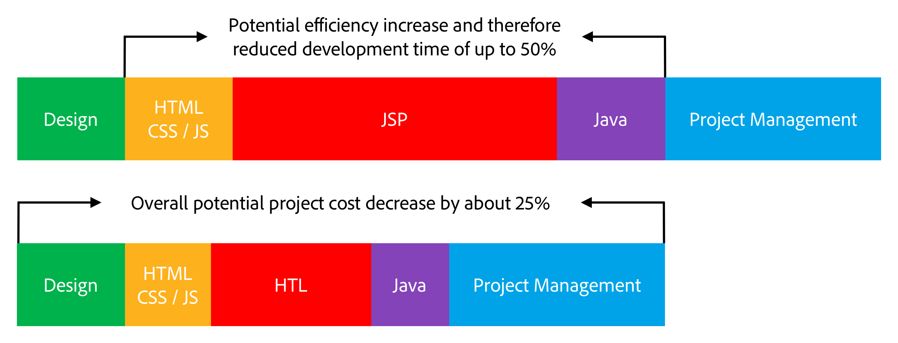

# Overview {#overview}

The **purpose** of HTML Template Language (HTL), supported by Adobe Experience Manager (AEM), is to offer a highly productive enterprise-level web framework that increases security, and allows HTML developers without Java knowledge to better participate in **AEM projects**.

The HTML Template Language has been introduced with AEM 6.0, and takes the place of JSP (JavaServer Pages) as the preferred and recommended server-side template system for HTML. For web developers who need to build robust enterprise websites, the HTML Template Language helps to achieve increased security and development efficiency.

## Increased Security {#increased-security}

The HTML Template Language increases the security of sites that use it in their implementation, as compared to JSP and to most other template systems, because HTL is capable of automatically applying the proper context-aware escaping to all variables being output to the presentation layer. HTL makes this possible because it understands the HTML syntax, and uses that knowledge to adjust the required escaping for expressions, based on their position in the markup. This will for instance result in expressions placed in `href` or `src` attributes to be escaped differently from expressions placed in other attributes, or elsewhere.

While the same result can be achieved with template languages like JSP, there the developer must manually ensure that the proper escaping is applied to each variable. As a single omission or mistake on the applied escaping is potentially sufficient to cause a cross-site scripting (XSS) vulnerability, we decided to automate this task with HTL. If needed, developers can still specify a different escaping on the expressions, but with HTL the default behavior is much more likely to correspond to the desired behavior, reducing the likelihood of errors **(adding here)**.

## Simplified Development {#simplified-development}

The HTML Template Language is easy to learn and its features are purposely limited to ensure that it stays simple and straight-forward. It also has powerful mechanisms for structuring the markup and invoking logic, while always enforcing strict separation of concerns between markup and logic. HTL itself is standard HTML5 as it uses expressions and data attributes to annotate the markup with the desired dynamic behavior, meaning that it doesn't break the validity of the markup and keeps it readable. Note that the evaluation of the expressions and data attributes is done entirely server-side and won't be visible on the client-side, where any desired JavaScript framework can be used without interfering.

These capabilities allow HTML developers without Java knowledge and with little product-specific knowledge to be able to edit HTL templates, allowing them to be part of the development team, and streamlining the collaboration with the full-stack Java developers. And vice versa this allows Java developers to focus on the back-end code without worrying about HTML.

## Reduced Costs {#reduced-costs}

Increased security, simplified development and improved team collaboration, translates for AEM projects in reduced effort, faster time to market (TTM), and lower total cost of ownership (TCO).

Concretely, from what has been observed when re-implementing the Adobe.com site with the HTML Template Language is that the cost and duration of the project could be reduced by about 25%.

The diagram above shows following improvements in efficiency potentially made possible by HTL:

* **HTML / CSS / JS:** Because the HTML developers are able to directly edit HTL templates, the front-end designs don't have to be implemented separately from the AEM project anymore, but can be implemented directly on the actual AEM components. This reduces painful iterations with the full-stack Java developers.
* **JSP / HTL:** Since HTL itself doesn't require any Java knowledge and is straight-forward to write, any developer with HTML expertise is empowered to edit the templates.
* **Java:** Thanks to the clear and simple to use Use-API provided by HTL, the interface with the business logic is clarified, which also benefits Java development overall.

**Read next:**

* [Getting Started with the HTML Template Language](getting-started.md)

